# front-end-foundations-workbook
Workbook for front-end foundations

This repo accompanies [Week 2 of the DWD class](https://github.com/itp-dwd/2020-spring/blob/master/weeks/02_front-end-foundations.md) and is roughly equivalent to the major points highlighted in the CSS and JavaScript content in the [Week 2 Slides](https://docs.google.com/presentation/d/1kmeu2AiWSQnX-e3nm-F0-Etsq1FvTHpClT0mIOH6NO4/edit)

## Overview

### [_template.html](./workbook/_template.html)

* the starting point!

### [00_setup.html](./workbook/00_setup.html)

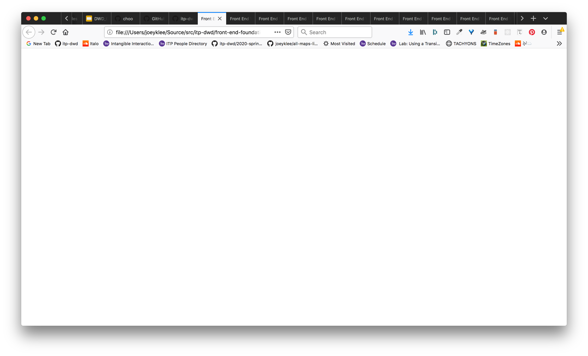

**Challenge**: 
+ Create a div with where id="app"
+ Within the div with id="app" create the following 
  DOM elements with the class definition:
  - nav class="nav"
  - header class="header"
  - main class="main"
  - footer class="footer"
### [01_content.html](./workbook/01_content.html)

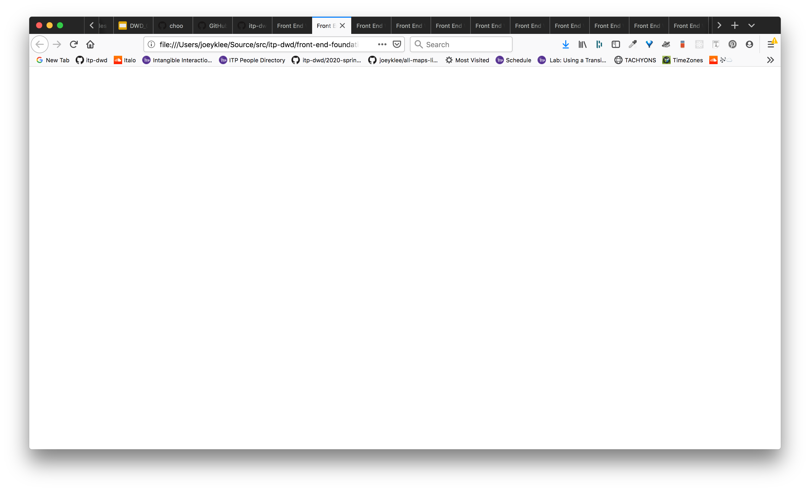

**Challenge**: 
+ In your nav:
  - add an unordered list that contains 3 list items of anchor tags. 
    your ul tag should be classed "nav__list". And each :
    1. <a href="/" target="_blank" noreferrer>Home</a>
    2. <a href="/about" target="_blank" noreferrer>About</a>
    3. <a href="/contact" target="_blank" noreferrer>Contact</a>
+ In your header:
  - add an h1 tag that includes the text: "I love you". Your h1 tag should have the class "header__title"
+ In your main tag:
  - add 3 tags with the following class names AND add some text inside:
    1. <menu class="menu">my menu</menu>
    2. <section class="content">my content</section>
    3. <aside class="aside">my aside</aside>
+ In your footer:
  - add 2 section tags with a paragraph tag in each with a simple sentence
    your paragraph tags should be classed "footer__content":
    1. <section class="footer__section"> <p class="footer__content">I love dinosaurs</p> </section>
    2. <section class="footer__section"> <p class="footer__content">I love nature</p> </section>

### [02_css-box-model-1.html](./workbook/02_css-box-model-1.html)

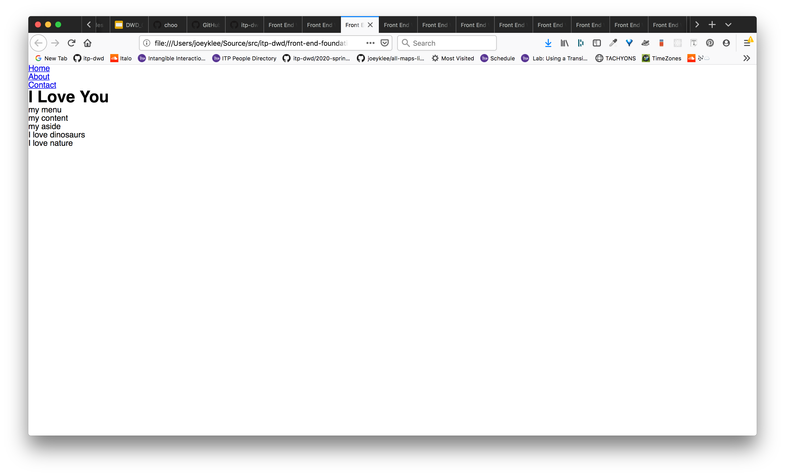
**Challenge**: 
+ Using a class called "debug", add a border around your nav, header, main, and footer:
  that is: 1px wide, solid, and black.
  ```
  .debug{
    border: 1px solid black;
  }
  ```
+ Give your nav, header, main, and footer a top and bottom padding of 1rem each and horizontal padding by 0.5rem
  by targeting each class name, e.g.:
  ```
  .nav{
    padding: 1rem 0.5rem 1rem 0.5rem:
  }
  ```


### [04_css-box-model-3.html](./workbook/04_css-box-model-3.html)

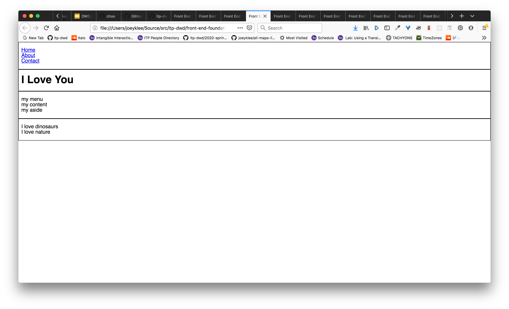
**Challenge**: 
+ target your ".menu", ".content", and ".aside" and add a background-color:
  e.g.:
  
  .menu{
    background-color: tomato;
  }
+ give your .main a height of 50vh;
+ give your .menu and .aside the width of "25%" and height of 100%;
+ give your .content class a width of "50%" and height of 100%;


### [05_css-flex-layout-1.html](./workbook/05_css-flex-layout-1.html)
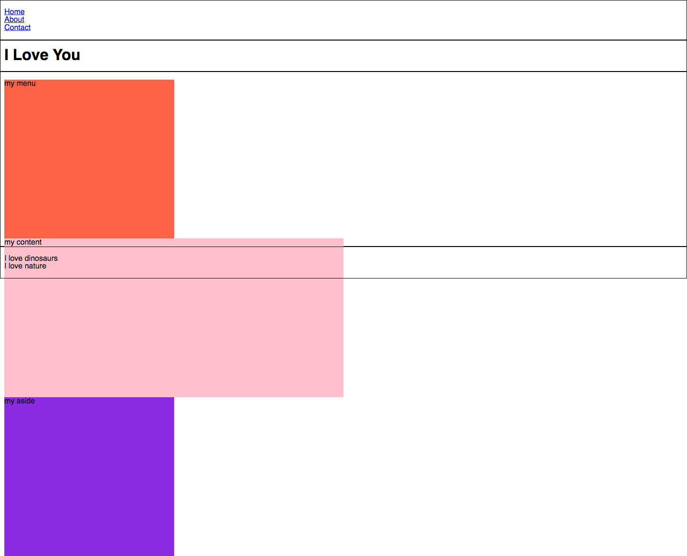
**Challenge**: 
+ use `display:flex` on the .main selector to make your main content items fit nicely into place. 

### [06_css-flex-layout-2.html](./workbook/06_css-flex-layout-2.html)
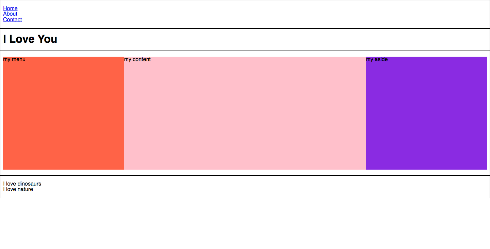
Challenge: 
+ target your .header and make the height: 80vh;
+ make your .header a flexbox container using `display:flex` and set the `flex-direction:column`
+ center horizontally and vertically the children of the .header by using `align-text:center` and `justify-content: center`
+ make your .header__title align text center using `align-text:center`

### [07_css-flex-layout-3.html](./workbook/07_css-flex-layout-3.html)
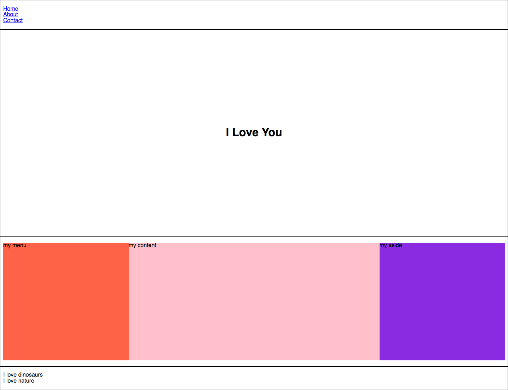
**Challenge**: 
+ make your .nav `background-color` a dark color like "purple"
+ make the anchor tag color all white with no underline style;
+ make your .nav__list a flex container with: `display:flex`
+ justify the content of the children of your .nav__list to `justify-content:flex-end`
+ remove the list style from the .nav__list by using `list-style:none`
+ add margin to each .nav__item EXCEPT the last item

### [08_css-flex-layout-4.html](./workbook/08_css-flex-layout-4.html)
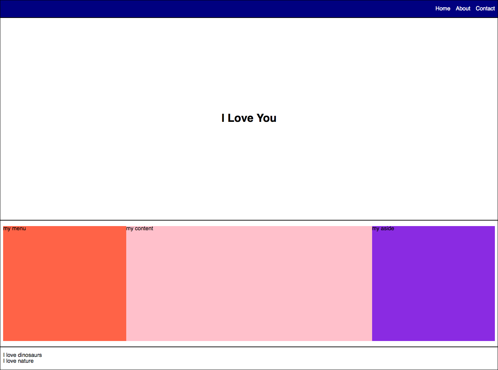
**Challenge**: 
+ make your .footer a flex container
+ justify your content with "space around" by doing : `justify-content:space-around`
+ make each .footer__section with a width of 40%;
+ target the .footer__content and set the text-align to center

### [09_css-flex-layout-5.html](./workbook/09_css-flex-layout-5.html)
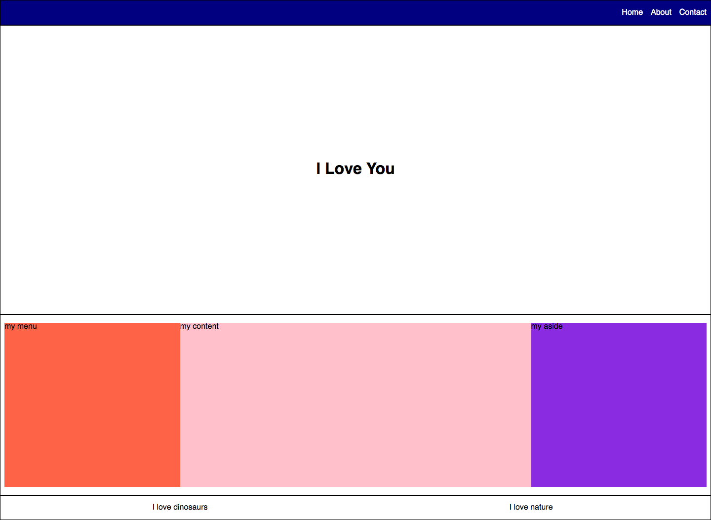
**Challenge**: 
+ when your screen size is less than 700px:
    + make your .menu, .content, and .aside width 100% 
    + Change the layout of your .main flex container from 
      flex-direction:row to flex-direction:column 
    + change your .main height to auto instead of using vh values

### [10_css-media-queries.html](./workbook/10_css-media-queries.html)


**Challenge**: 
+ add a background image to your .header using `background-image:url( URL TO YOUR IMAGE FROM THE INTERNET )`
+ set the `background-position: center`, `background-size:cover`, `background-repeat:no-repeat`


### [11_css-background-image.html](./workbook/11_css-background-image.html)

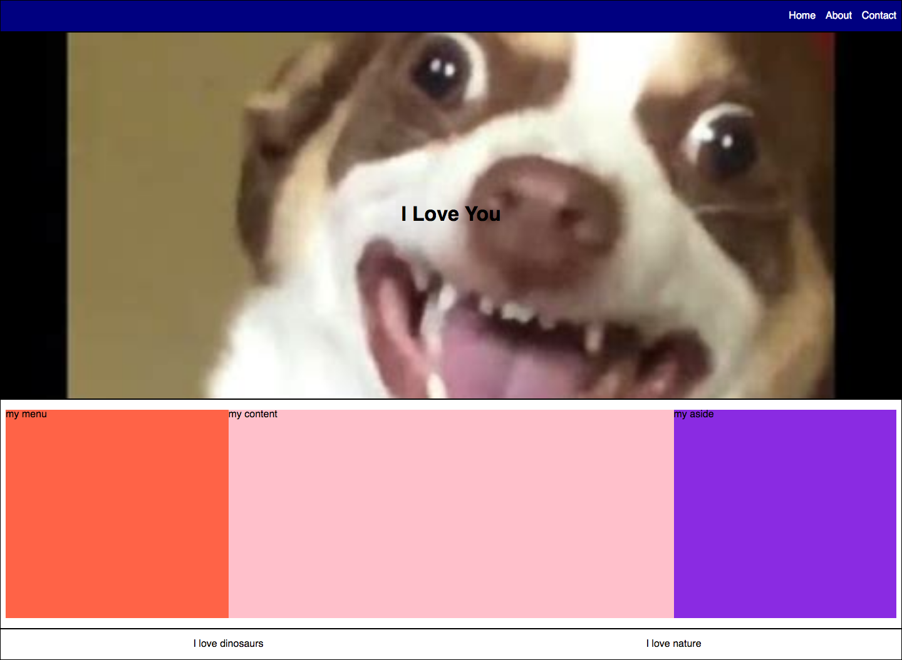

**Challenge**: 
+ use javascript to add 10 articles to your .content area using 
  - querySelector() to select the .content class 
  - createElement() to create an element
  - element.textContent to add the text: article + index number using string literals `${}`
  - parent.append( childElement ) to add your created element to the .content section


### [12_js-adding-dom-elements.html](./workbook/12_js-adding-dom-elements.html)

**Challenge**: 
+ change the .aside background color on a "click" event to yellow

### [13_js-click-event.html](./workbook/13_js-click-event.html)

**Challenge**: 
+ create a class called .bg-yellow and .bg-purple
+ apply the .bg-yellow class to the .content element if the .content element.contains(".bg-purple") 
 , if the opposite is true, then apply the .bg-yellow class

### [14_js-click-event-logic.html](./workbook/14_js-click-event-logic.html)

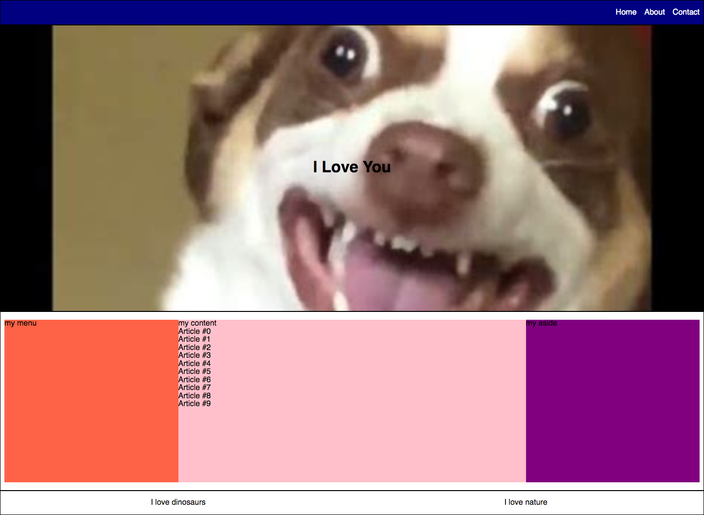
Done!


